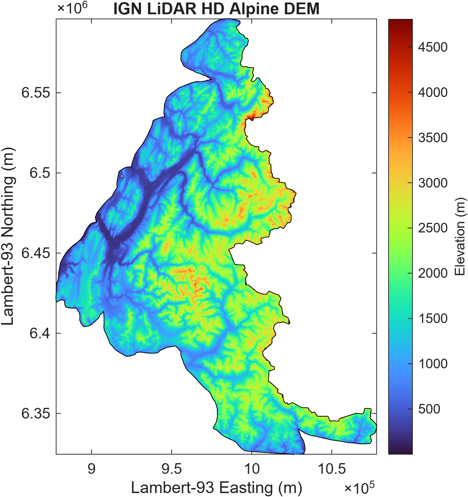
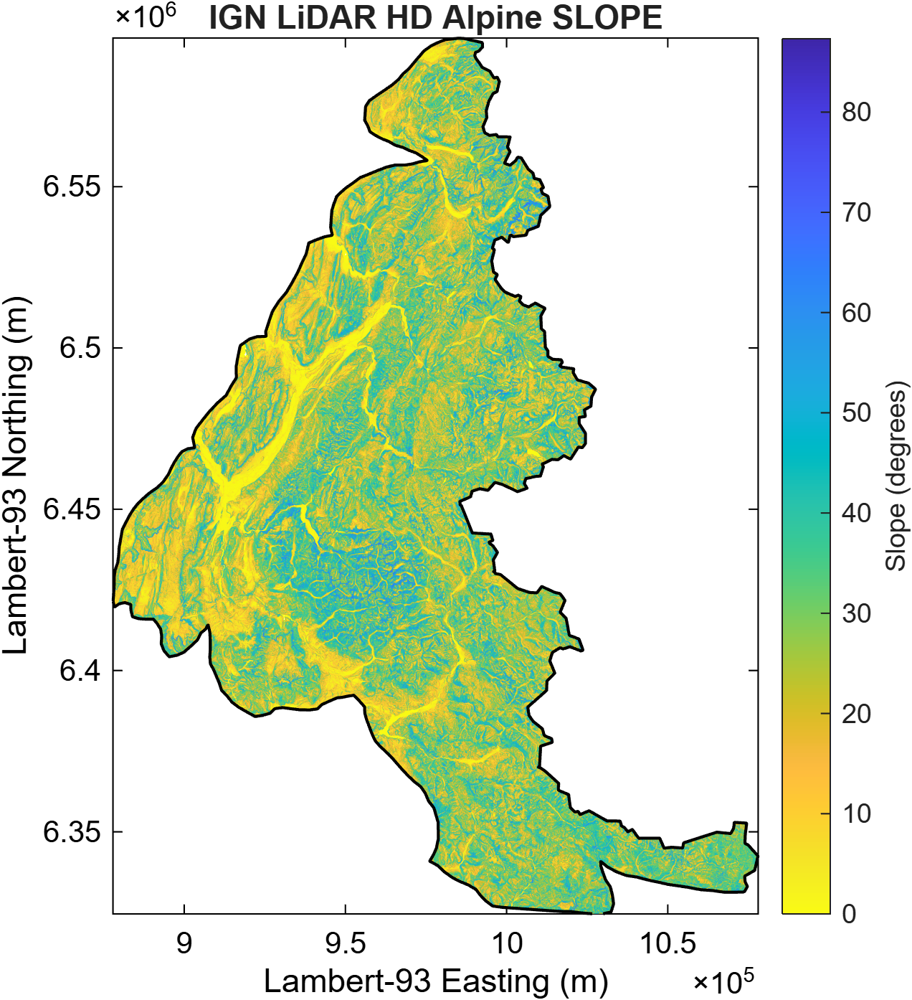
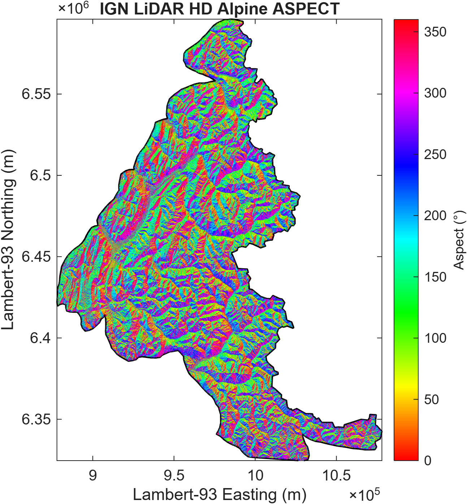
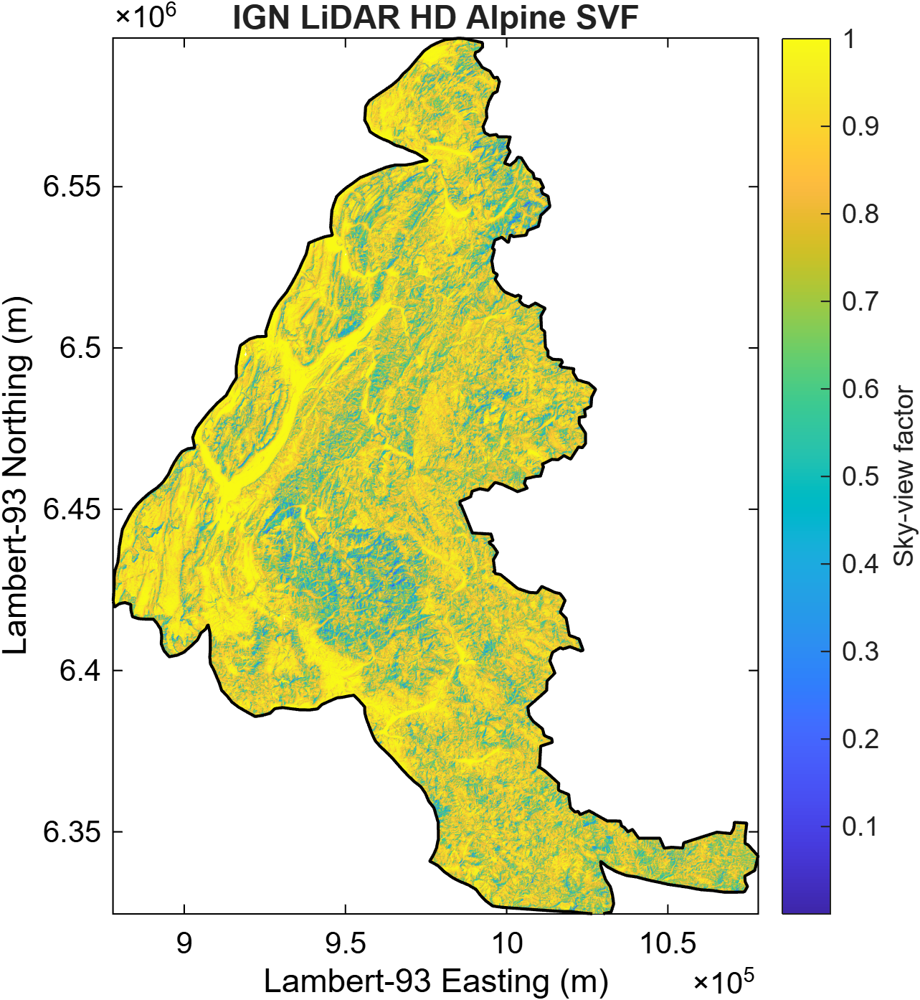
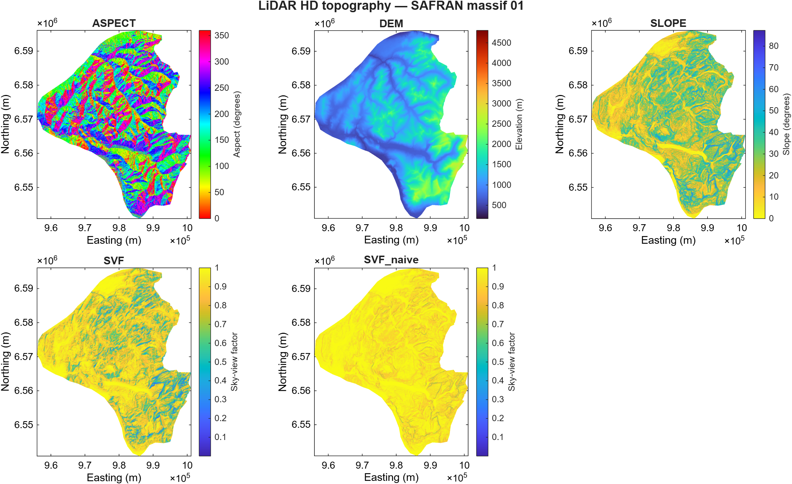

# IGN LiDAR HD DEM workflow

Last revision: August 2026 (Pozsgay V.)

This folder contains the MATLAB workflow used to download and process **IGN LiDAR HD elevation data** for CryoGrid mountain permafrost applications in the French Alps.

The workflow generates a consistent set of 10 m topographic products from IGN LiDAR HD data over the SAFRAN French Alps massif domain.

## Main products

* DEM for each SAFRAN massif
* binary massif masks
* continuous Alpine DEM and mask
* Alpine slope and aspect
* terrain-based sky-view factor (SVF)
* massif-scale clipped topographic products
* CryoGrid-compatible aspect
* slope-only naive SVF reference
* cached IGN WMS downloads
* quality-control diagnostics and validation tables

The current production configuration uses:

```matlab
Resolution = 10
```

---

## Organization

The workflow source code is kept separate from generated DEM products.

```text
CryoGrid/
│
├── CryoGridCommunity_source/
│   └── source/
│       └── VP_DEM/
│           └── LiDAR_HD_DEM/
│               ├── prepare_dem.m
│               ├── run_lidar_diagnostics.m
│               ├── processing/
│               ├── plotting/
│               └── README.md
│
└── CryoGridCommunity_forcing/
    └── DEM/
        └── LiDAR_HD_DEM_10m/
            ├── DEM/
            │   ├── cache/
            │   ├── DEM_massif_XX.tif
            │   ├── DEM_mask_massif_XX.tif
            │   └── ALPS/
            │       ├── DEM_ALPS.tif
            │       └── DEM_ALPS_mask.tif
            │
            ├── SLOPE/
            │   ├── SLOPE_massif_XX.tif
            │   └── ALPS/
            │       └── SLOPE_ALPS.tif
            │
            ├── ASPECT/
            │   ├── ASPECT_massif_XX.tif
            │   └── ALPS/
            │       └── ASPECT_ALPS.tif
            │
            ├── ASPECT_CryoGrid/
            │   └── ASPECT_CryoGrid_massif_XX.tif
            │
            ├── SVF/
            │   ├── SVF_massif_XX.tif
            │   └── ALPS/
            │       └── SVF_ALPS.tif
            │
            ├── SVF_naive/
            │   └── SVF_naive_massif_XX.tif
            │
            └── diagnostics/
```

`CryoGridCommunity_forcing/` is excluded from Git because the generated GeoTIFF products and IGN WMS cache can become very large.

The `LiDAR_HD_DEM/` source folder contains only workflow code. Plotting-specific functions and their supporting visualization utilities are kept in `plotting/`.

---

## Coordinate system and conventions

All generated topographic products use:

| Property                  | Value      |
| ------------------------- | ---------- |
| Projection                | Lambert-93 |
| EPSG                      | 2154       |
| Horizontal units          | metres     |
| Elevation units           | metres     |
| Vertical reference        | IGN69      |
| Default raster resolution | 10 m       |

### NoData convention

Pixels outside the valid DEM domain are stored in the GeoTIFF products as:

```text
-9999
```

Internally, processing and visualization functions convert invalid raster values to `NaN` when appropriate.

The original GeoTIFF products are **not modified during visualization**.

---

# Main workflow

The complete workflow is executed through:

```matlab
prepare_dem(...)
```

Main function:

[`prepare_dem.m`](./prepare_dem.m)

The workflow follows these steps:

1. Read SAFRAN massif polygons
2. Build DEM products for individual massifs
3. Merge massif DEMs into one continuous Alpine DEM
4. Compute Alpine terrain derivatives
5. Compute the full-Alps terrain-based SVF
6. Clip Alpine topographic products to massifs
7. Convert aspect to the CryoGrid convention
8. Compute naive slope-based SVF
9. Optionally run LiDAR diagnostics

This ordering is important: **terrain derivatives and terrain-based SVF are calculated from the continuous Alpine DEM before massif clipping.**

This avoids artificial terrain discontinuities at SAFRAN massif boundaries and allows the SVF calculation to see surrounding terrain.

---

## `prepare_dem()` options

### Resolution

Default:

```matlab
"Resolution",10
```

Example:

```matlab
prepare_dem( ...
    dem_path, ...
    path_shapefile, ...
    "Resolution",5)
```

The resolution controls the DEM pixel size, WMS requests, and generated output directory.

For example:

```text
LiDAR_HD_DEM_10m/
LiDAR_HD_DEM_5m/
```

### Overwrite

Default:

```matlab
"Overwrite",false
```

Existing products are reused whenever supported.

To force recomputation:

```matlab
prepare_dem( ...
    dem_path, ...
    path_shapefile, ...
    "Overwrite",true)
```

### Diagnostics

Default:

```matlab
"Diagnostics",false
```

To generate the complete diagnostic suite:

```matlab
prepare_dem( ...
    dem_path, ...
    path_shapefile, ...
    "Diagnostics",true)
```

This automatically calls:

[`run_lidar_diagnostics.m`](./run_lidar_diagnostics.m)

after all topographic products have been generated.

### SVF parameters

The full-Alps SVF can be configured with:

```matlab
"SVFNumBins",36
"SVFMaxDistance",1000
```

The defaults are therefore:

```text
Azimuth bins       : 36
Azimuth spacing    : 10°
Maximum distance   : 1000 m
```

---

## Step 1 — Read SAFRAN massif polygons

`prepare_dem()` reads the SAFRAN massif shapefile and sorts the massifs by `massif_num`.

Required properties:

* Lambert-93 projection
* EPSG:2154
* `massif_num` attribute

The shapefile is used throughout the workflow to define the individual massif domains.

---

## Step 2 — Build massif DEM products

Main processing function:

[`process_single_massif.m`](./processing/process_single_massif.m)

For each SAFRAN massif, the workflow:

1. determines the required bounding box
2. splits large requests into WMS-compatible chunks
3. downloads IGN LiDAR HD elevation data
4. reuses cached chunks when available
5. cleans invalid WMS pixels
6. merges the chunks
7. clips the result to the SAFRAN polygon
8. writes the massif DEM
9. writes the corresponding binary mask

The resulting files are:

```text
DEM/
├── DEM_massif_XX.tif
└── DEM_mask_massif_XX.tif
```

### Massif DEM

`DEM_massif_XX.tif` contains elevation in metres.

Pixels outside the valid massif DEM domain are stored as:

```text
-9999
```

### Massif mask

`DEM_mask_massif_XX.tif` contains:

| Value | Meaning               |
| ----: | --------------------- |
|     1 | Inside SAFRAN massif  |
|     0 | Outside SAFRAN massif |

The mask is retained separately because it is useful for validation and subsequent processing.

---

## Step 3 — Merge massif DEMs into the Alpine DEM

Main function:

[`merge_massif_DEMs.m`](./processing/merge_massif_DEMs.m)

All massif DEMs are merged into one continuous Alpine grid:

```text
DEM/
└── ALPS/
    ├── DEM_ALPS.tif
    └── DEM_ALPS_mask.tif
```

The Alpine DEM provides the common modelling grid for all subsequent terrain calculations.

The merge does not resample or reproject the massif products.

---

## Step 4 — Compute Alpine terrain derivatives

Main function:

[`compute_dem_derivatives.m`](./processing/compute_dem_derivatives.m)

Terrain derivatives are calculated directly from:

```text
DEM/ALPS/DEM_ALPS.tif
```

before any massif clipping.

The Alpine products are:

```text
SLOPE/
└── ALPS/
    └── SLOPE_ALPS.tif

ASPECT/
└── ALPS/
    └── ASPECT_ALPS.tif
```

They are subsequently clipped to individual SAFRAN massifs during Step 6.

### Slope

Slope is stored in degrees:

```text
0°  = flat
90° = vertical
```

### Aspect

The standard geographic aspect convention is:

```text
0°   = North
90°  = East
180° = South
270° = West
```

The physical geographic aspect product is preserved independently from the CryoGrid-specific aspect conversion.

---

## Step 5 — Compute terrain-based sky-view factor

Main function:

[`compute_skyview_factor_alps.m`](./processing/compute_skyview_factor_alps.m)

The workflow calculates a terrain-based **sky-view factor (SVF)** over the continuous Alpine DEM using horizon ray tracing.

The resulting product is:

```text
SVF/
└── ALPS/
    └── SVF_ALPS.tif
```

The SVF represents the fraction of the sky hemisphere visible from a DEM location while accounting for surrounding terrain and local surface orientation.

### Ray-tracing method

For each target pixel:

1. elevation, slope and aspect are obtained from the Alpine products
2. rays are traced through multiple azimuth directions
3. terrain horizon angles are determined up to the selected maximum distance
4. the horizon information is combined with the local slope and aspect
5. the azimuthal contributions are integrated over 360°
6. the resulting SVF is written to GeoTIFF

Ray coordinates are converted to raster indices using continuous-coordinate rounding.

Consecutive ray samples falling in the same raster cell are removed as an optimization while retaining the nearest occurrence.

The calculation is parallelized over independent blocks using MATLAB's process-based parallel pool.

### Default configuration

```text
DEM resolution       : 10 m
Maximum horizon      : 1000 m
Azimuth bins         : 36
Azimuth spacing      : 10°
```

These parameters are configurable through `prepare_dem()`.

Increasing the number of azimuth bins or the maximum horizon distance improves the representation of terrain obstruction but increases computational cost.

### Chunked Alpine processing

The full Alpine DEM is too large to process as one in-memory SVF calculation.

The implementation therefore processes the Alpine domain in spatial chunks with a surrounding horizon buffer.

Importantly, SVF is calculated over the **continuous Alpine DEM**, rather than independently inside each SAFRAN massif.

This allows terrain outside an individual massif to contribute to its horizon.

### NoData and boundaries

NoData terrain is not filled or interpolated.

Rays can therefore pass through NoData regions and subsequently encounter valid terrain. This avoids inventing elevations, but horizons close to the Alpine DEM boundary or internal NoData gaps may be less reliable.

Other limitations include:

* finite horizon distance
* finite azimuth resolution
* finite DEM resolution
* discrete raster ray tracing
* missing terrain outside the DEM domain
* no vegetation or buildings
* static topography
* no explicit representation of snow or glacier changes

### Horizon-distance sensitivity

Testing on a 301 × 301 pixel Alpine test window showed that increasing the horizon distance from 1 km to several kilometres has a relatively small effect compared with replacing the local slope-only approximation by terrain-based ray tracing.

For 1 km versus 5 km:

```text
Mean difference    : 0.004613
Median difference  : 0.001499
Mean |difference|  : 0.004613
Max |difference|   : 0.056746
95th percentile    : 0.019230
99th percentile    : 0.028998
|difference| > .01 : 16.16 %
|difference| > .02 : 4.58 %
|difference| > .05 : 0.01 %
```

The default maximum horizon distance is therefore **1 km**, providing a practical balance between physical representation and computational cost.

---

## Step 6 — Clip Alpine products to SAFRAN massifs

Main function:

[`clip_topography_products.m`](./processing/clip_topography_products.m)

The Alpine products are extracted back onto the individual massif domains.

Products include:

```text
DEM/
└── DEM_massif_XX.tif

SLOPE/
└── SLOPE_massif_XX.tif

ASPECT/
└── ASPECT_massif_XX.tif

SVF/
└── SVF_massif_XX.tif
```

The massif products are extracted from the exact Alpine grid.

No resampling or reprojection is performed.

This ensures that DEM, slope, aspect and SVF remain spatially consistent.

Pixels outside the massif are stored as:

```text
-9999
```

---

## Step 7 — Convert aspect to CryoGrid convention

Main function:

[`convert_aspect_to_cryogrid.m`](./processing/convert_aspect_to_cryogrid.m)

CryoGrid uses a different aspect convention:

```text
0°   = South
90°  = East
180° = North
270° = West
```

The workflow therefore creates:

```text
ASPECT_CryoGrid/
└── ASPECT_CryoGrid_massif_XX.tif
```

The original geographic aspect products are retained unchanged.

---

## Step 8 — Compute naive slope-based SVF

Main function:

[`compute_naive_svf.m`](./processing/compute_naive_svf.m)

The workflow also produces a local slope-only SVF reference:

```text
SVF_naive/
└── SVF_naive_massif_XX.tif
```

It is calculated as:

```text
SVF_naive = (1 + cos(slope)) / 2
           = cos²(slope / 2)
```

This approximation accounts only for local surface inclination.

It does **not** account for surrounding terrain or terrain horizons.

It is therefore retained as a reference for comparison with the terrain-based ray-traced SVF.

---

## Step 9 — Quality-control diagnostics

Main function:

[`run_lidar_diagnostics.m`](./run_lidar_diagnostics.m)

Diagnostics are optional and are enabled with:

```matlab
prepare_dem( ...
    dem_path, ...
    path_shapefile, ...
    "Diagnostics",true)
```

They can also be run independently:

```matlab
run_lidar_diagnostics( ...
    output_path, ...
    path_shapefile, ...
    1)
```

The diagnostic workflow:

1. validates the massif DEMs
2. computes Alpine-wide plotting bounds
3. creates a DEM overview
4. plots missing DEM pixels
5. creates Alpine product overviews
6. creates individual massif topography figures
7. writes validation tables
8. copies the complete `diagnostics/` folder into the workflow source directory for convenient inspection

The generated files are stored in:

```text
LiDAR_HD_DEM_10m/
└── diagnostics/
```

### Diagnostic plots

All plotting functions are organized under:

```text
source/VP_DEM/LiDAR_HD_DEM/plotting/
```

The plotting folder also contains visualization-only helper functions used by those plotting functions.

This keeps diagnostic visualization code separate from DEM generation and scientific processing.

#### DEM massif overview


Generated as:

```text
diagnostics/
└── LiDAR_HD_DEM_massifs.png
```

Shows:

* all available massif DEMs
* common elevation scale
* SAFRAN massif boundaries
* massif numbers

#### Missing-pixel overview


Generated as:

```text
diagnostics/
└── LiDAR_HD_DEM_missing_pixels.png
```

Shows pixels that are simultaneously:

* inside the SAFRAN massif mask
* missing from the DEM

Missing pixels are plotted as points rather than generating a full-resolution graphics object.

#### Alpine product overviews







For each available Alpine product, the diagnostic workflow creates:

```text
diagnostics/
├── LiDAR_HD_DEM_ALPS_overview.png
├── LiDAR_HD_SLOPE_ALPS_overview.png
├── LiDAR_HD_ASPECT_ALPS_overview.png
└── LiDAR_HD_SVF_ALPS_overview.png
```

The diagnostic workflow automatically detects products following:

```text
PRODUCT/
└── ALPS/
    └── PRODUCT_ALPS.tif
```

Therefore newly added Alpine products can be incorporated into the diagnostic workflow without hard-coding every product name.

The same Alpine-wide visualization bounds are used for corresponding massif and Alpine products whenever available.

#### Individual massif topography



For each massif, the workflow can generate:

```text
diagnostics/
└── LiDAR_HD_massif_XX_topography.png
```

Each figure contains all available topographic products for that massif, including products such as:

```text
DEM
SLOPE
ASPECT
SVF
SVF_naive
ASPECT_CryoGrid
```

The exact set depends on which products are present.

All rasters are downsampled before plotting.

The original GeoTIFFs are never modified.


### Validation tables

The diagnostics generate:

```text
diagnostics/
├── LiDAR_HD_DEM_validation.csv
└── LiDAR_HD_DEM_validation.md
```

The validation table contains:

| Variable             | Description                             |
| -------------------- | --------------------------------------- |
| `massif`             | SAFRAN massif number                    |
| `DEM_pixels`         | Number of pixels inside the massif mask |
| `missing_pixels`     | Pixels without valid elevation          |
| `missing_percentage` | Percentage of missing pixels            |

The Markdown table can be viewed directly:

[LiDAR DEM validation table](diagnostics/LiDAR_HD_DEM_validation.md)

The CSV version is available at:

[LiDAR DEM validation CSV](diagnostics/LiDAR_HD_DEM_validation.csv)

---

# IGN WMS downloads and restart capability

IGN LiDAR HD WMS requests become unreliable for very large images.

The workflow therefore limits individual requests to:

```text
Maximum width  : 4000 pixels
Maximum height : 4000 pixels
```

Large massif requests are automatically split into smaller chunks.

Processing utilities include:

[`download_lidar_chunk.m`](./processing/download_lidar_chunk.m)

[`split_dem_bbox.m`](./processing/split_dem_bbox.m)

[`clean_lidar_chunk.m`](./processing/clean_lidar_chunk.m)

[`merge_dem_chunks.m`](./processing/merge_dem_chunks.m)

Cached chunks are stored in:

```text
DEM/cache/
```

Existing chunks are reused when possible, allowing the workflow to be restarted after interruption without downloading everything again.

The cache should therefore be preserved during normal workflow operation.

---

# MATLAB function organization

## Main workflow

| Function                                               | Location        | Purpose                           |
| ------------------------------------------------------ | --------------- | --------------------------------- |
| [`prepare_dem.m`](./prepare_dem.m)                     | `LiDAR_HD_DEM/` | Complete DEM preparation workflow |
| [`run_lidar_diagnostics.m`](./run_lidar_diagnostics.m) | `LiDAR_HD_DEM/` | Complete quality-control workflow |

## Processing functions

Located in:

```text
LiDAR_HD_DEM/processing/
```

| Function                                                                      | Purpose                            |
| ----------------------------------------------------------------------------- | ---------------------------------- |
| [`process_single_massif.m`](./processing/process_single_massif.m)             | Build one massif DEM               |
| [`download_lidar_chunk.m`](./processing/download_lidar_chunk.m)               | Download an IGN WMS chunk          |
| [`split_dem_bbox.m`](./processing/split_dem_bbox.m)                           | Split large WMS requests           |
| [`clean_lidar_chunk.m`](./processing/clean_lidar_chunk.m)                     | Clean invalid WMS data             |
| [`merge_dem_chunks.m`](./processing/merge_dem_chunks.m)                       | Merge downloaded chunks            |
| [`clip_dem_polygon.m`](./processing/clip_dem_polygon.m)                       | Clip DEM to massif geometry        |
| [`write_dem_geotiff.m`](./processing/write_dem_geotiff.m)                     | Write DEM GeoTIFF products         |
| [`merge_massif_DEMs.m`](./processing/merge_massif_DEMs.m)                     | Build the continuous Alpine DEM    |
| [`compute_dem_derivatives.m`](./processing/compute_dem_derivatives.m)         | Compute Alpine slope and aspect    |
| [`compute_skyview_factor_alps.m`](./processing/compute_skyview_factor_alps.m) | Compute full-Alps ray-traced SVF   |
| [`compute_svf_raycast.m`](./processing/compute_svf_raycast.m)                 | Perform SVF horizon ray tracing    |
| [`clip_topography_products.m`](./processing/clip_topography_products.m)       | Extract Alpine products to massifs |
| [`convert_aspect_to_cryogrid.m`](./processing/convert_aspect_to_cryogrid.m)   | Convert aspect convention          |
| [`compute_naive_svf.m`](./processing/compute_naive_svf.m)                     | Compute slope-only SVF reference   |

Additional low-level processing helpers may be present in this folder and are used internally by the functions above.

## Plotting functions

Located in:

```text
LiDAR_HD_DEM/plotting/
```

| Function                                                                | Purpose                                           |
| ----------------------------------------------------------------------- | ------------------------------------------------- |
| [`plot_lidar_dem_base.m`](./plotting/plot_lidar_dem_base.m)             | Create the common massif DEM overview             |
| [`plot_lidar_missing_pixels.m`](./plotting/plot_lidar_missing_pixels.m) | Plot missing DEM pixels                           |
| [`plot_alps_topography.m`](./plotting/plot_alps_topography.m)           | Plot an Alpine-wide topographic product           |
| [`plot_massif_topography.m`](./plotting/plot_massif_topography.m)       | Plot all available products for one massif        |
| [`downsample_topography.m`](./plotting/downsample_topography.m)         | Efficient visualization downsampling              |
| [`get_topography_bounds.m`](./plotting/get_topography_bounds.m)         | Determine consistent visualization bounds         |
| [`get_topography_colormap.m`](./plotting/get_topography_colormap.m)     | Define product-specific visualization conventions |

The plotting folder may also contain small internal helpers used exclusively by the diagnostic visualization workflow.

---

# Restartability and generated data

The workflow is designed to be restartable.

In particular:

* downloaded WMS chunks are cached
* existing massif DEMs can be reused
* existing Alpine products can be reused where supported
* diagnostic generation is independent from DEM generation
* `Overwrite=true` can be used when a complete recomputation is required

The generated dataset should therefore be treated as persistent workflow output rather than temporary files.

---

# Summary of generated products

At the default 10 m resolution, the final product tree is:

```text
LiDAR_HD_DEM_10m/
│
├── DEM/
│   ├── cache/
│   ├── DEM_massif_XX.tif
│   ├── DEM_mask_massif_XX.tif
│   └── ALPS/
│       ├── DEM_ALPS.tif
│       └── DEM_ALPS_mask.tif
│
├── SLOPE/
│   ├── SLOPE_massif_XX.tif
│   └── ALPS/
│       └── SLOPE_ALPS.tif
│
├── ASPECT/
│   ├── ASPECT_massif_XX.tif
│   └── ALPS/
│       └── ASPECT_ALPS.tif
│
├── ASPECT_CryoGrid/
│   └── ASPECT_CryoGrid_massif_XX.tif
│
├── SVF/
│   ├── SVF_massif_XX.tif
│   └── ALPS/
│       └── SVF_ALPS.tif
│
├── SVF_naive/
│   └── SVF_naive_massif_XX.tif
│
└── diagnostics/
    ├── LiDAR_HD_DEM_massifs.png
    ├── LiDAR_HD_DEM_missing_pixels.png
    ├── LiDAR_HD_DEM_ALPS_overview.png
    ├── LiDAR_HD_SLOPE_ALPS_overview.png
    ├── LiDAR_HD_ASPECT_ALPS_overview.png
    ├── LiDAR_HD_SVF_ALPS_overview.png
    ├── LiDAR_HD_massif_XX_topography.png
    ├── LiDAR_HD_DEM_validation.csv
    └── LiDAR_HD_DEM_validation.md
```

Additional diagnostic plots may appear depending on the products available when `run_lidar_diagnostics()` is executed.

---

# Important notes

* The workflow currently targets the French Alps SAFRAN massif domain.
* All products use Lambert-93 / EPSG:2154.
* The default DEM resolution is 10 m.
* Pixels outside valid DEM domains are stored as `-9999`.
* The continuous Alpine DEM is the basis for terrain derivatives and ray-traced SVF.
* Terrain derivatives are computed before massif clipping.
* SVF is calculated over the continuous Alpine terrain rather than independently for each massif.
* The physical geographic aspect convention is preserved.
* CryoGrid aspect is stored as a separate product.
* `SVF_naive` is retained only as a slope-only reference.
* WMS chunks are cached and should normally be preserved.
* Visualization functions downsample large rasters before plotting and never modify the source GeoTIFFs.
* Generated DEM products and caches are excluded from Git.
* Diagnostic outputs are stored in the generated `diagnostics/` folder and copied into the workflow source tree for convenient inspection.
