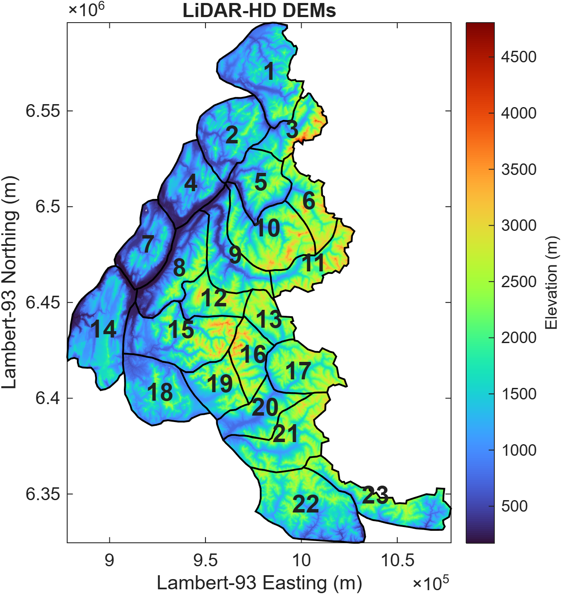
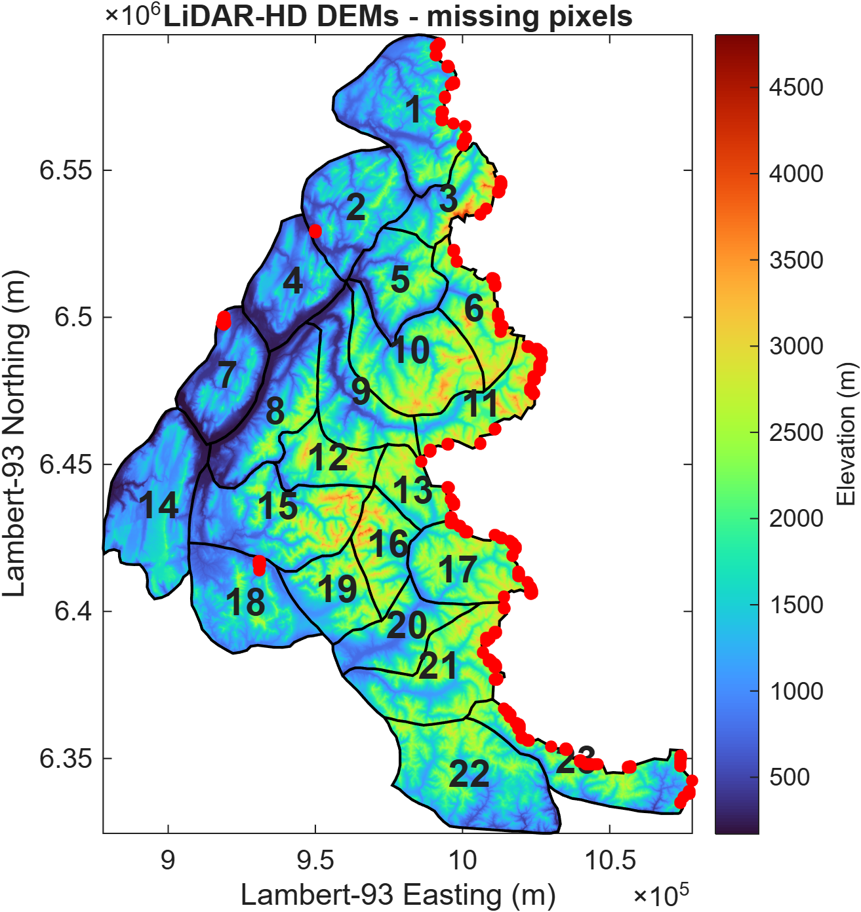

# IGN LiDAR HD DEM workflow

Last revision July 2026 (Pozsgay V.)

This folder contains the MATLAB workflow used to download and process **IGN LiDAR HD elevation data** for CryoGrid mountain permafrost applications in the French Alps.

The workflow generates high-resolution topographic inputs from IGN LiDAR HD data and produces one DEM product per SAFRAN massif.

The current generated dataset uses:

```
Resolution = 10 m
```

The workflow produces:

- one clipped DEM GeoTIFF per SAFRAN massif
- one binary massif mask GeoTIFF per massif
- one merged Alpine DEM covering the complete French Alpine modelling domain
- terrain derivatives (currently slope and aspect)
- clipped terrain derivatives for every SAFRAN massif
- cached IGN WMS chunks for restart capability

Terrain derivatives are computed from the merged Alpine DEM before being clipped back to individual SAFRAN massifs. This avoids artificial discontinuities at massif boundaries while preserving the exact massif grids.

---

# Organization

The workflow code and generated datasets are separated:

```
CryoGrid/

└── CryoGridCommunity_source/
    └── source/
        └── VP_DEM/
            └── LiDAR_HD_DEM/
                ├── prepare_dem.m
                ├── process_single_massif.m
                ├── run_lidar_diagnostics.m
                ├── processing/
                └── README.md


CryoGridCommunity_forcing/
└── DEM/
    └── LiDAR_HD_DEM_10m/
        ├── DEM/
        │   ├── cache/
        │   ├── DEM_massif_XX.tif
        │   ├── DEM_mask_massif_XX.tif
        │   └── ALPS/
        │       ├── DEM_ALPS_10m.tif
        │       └── DEM_ALPS_mask_10m.tif
        │
        └── diagnostics/ (generated separately)
```

The `CryoGridCommunity_forcing/` folder is excluded from Git because generated DEM products and IGN cache files can become very large.

---

# Overview

The workflow performs:

1. Reads SAFRAN massif polygons
2. Queries IGN LiDAR HD elevation data through the IGN WMS service
3. Splits large requests into WMS-compatible chunks
4. Downloads and caches individual chunks
5. Removes WMS resampling artefacts
6. Merges chunks into individual massif DEMs
7. Clips DEMs to SAFRAN massif boundaries
8. Saves massif DEM and binary mask GeoTIFF files
9. Merges all massif DEMs into one Alpine DEM
10. Computes Alpine terrain derivatives
11. Clips terrain derivatives back to individual SAFRAN massifs
12. Generates quality-control diagnostics

The Alpine DEM merge is performed without resampling. When overlapping pixels occur, valid elevation data replace NoData values (`-9999`) while existing valid values are preserved.

Terrain derivatives are computed only once from the merged Alpine DEM before being clipped back onto the exact massif grids using the corresponding massif masks. This avoids edge effects between neighbouring SAFRAN massifs while guaranteeing identical grid geometry for all topographic products.

Quality-control diagnostics can be generated separately using [`run_lidar_diagnostics.m`](./run_lidar_diagnostics.m).

The resulting DEMs are designed as topographic inputs for CryoGrid simulations.

# Coordinate system

All products use:

| Property           | Value      |
| ------------------ | ---------- |
| Projection         | Lambert-93 |
| EPSG               | 2154       |
| Horizontal units   | metres     |
| Elevation units    | metres     |
| Vertical reference | IGN69      |

---

# Spatial resolution

Function: [`prepare_dem.m`](./prepare_dem.m).

The workflow supports arbitrary output resolution.

The requested resolution is controlled using the `Resolution` option of:

```matlab
prepare_dem()
```

Example: generate 5 m DEMs:

```matlab
prepare_dem( ...
    "CryoGridCommunity_forcing/DEM",
    "CryoGridCommunity_forcing/meteo/SAFRAN/shapefile/massifs_alpes_2154.shp", ...
    "Resolution",5)
```

The currently available dataset was generated using:

```matlab
"Resolution",10
```

and therefore contains:

```
10 m × 10 m pixels
```

stored in:

```
CryoGridCommunity_forcing/
└── DEM/
    └── LiDAR_HD_DEM_10m/
```

The workflow automatically adapts the WMS request size according to the requested resolution.

Large SAFRAN massifs are divided into smaller chunks to respect IGN service limitations.

---

# IGN WMS request size

Large WMS requests can fail or return incomplete data. Based on empirical testing, requests of 4000 × 4000 pixels provide the best compromise between download efficiency and reliability while retaining a safety margin relative to the practical service limits. Larger requests may work occasionally but are significantly less robust, especially for large SAFRAN massifs. The workflow therefore automatically subdivides each massif into requests no larger than 4000 × 4000 pixels.

---

# Input data

The main input is the SAFRAN massif shapefile:

```
massifs_alpes_2154.shp
```

found in

```
CryoGrid/
└── CryoGridCommunity_forcing/
    └── meteo/
        └── SAFRAN/
            └── shapefile/
                └── massifs_alpes_2154.shp
```

The shapefile must:

* be projected in Lambert-93 (EPSG:2154)
* contain the attribute:

```
massif_num
```

which identifies each SAFRAN massif, and

```
nom
```

which is its official SAFRAN name.

---

# DEM generation

The main workflow is [`prepare_dem.m`](./prepare_dem.m).

Example:

```matlab
prepare_dem( ...
    "CryoGridCommunity_forcing/DEM",
    "CryoGridCommunity_forcing/meteo/SAFRAN/shapefile/massifs_alpes_2154.shp")
```

The function supports:

## Resolution

Default:

```matlab
Resolution = 10
```

Example:

```matlab
prepare_dem(...,"Resolution",20)
```

## Overwrite

Existing DEMs are preserved by default.

To rebuild:

```matlab
prepare_dem(...,"Overwrite",true)
```

---

# Generated data

The output dataset is located at:

```
CryoGridCommunity_forcing/
└── DEM/
    └── LiDAR_HD_DEM_10m/
```

The folder contains:

```
LiDAR_HD_DEM_10m/

├── DEM/
│   ├── cache/
│   │   ├── massif_01/
│   │   │   ├── chunk_001.tif
│   │   │   └── ...
│   │   └── ...
│   │
│   ├── DEM_massif_01.tif
│   ├── DEM_massif_02.tif
│   ├── ...
│   ├── DEM_mask_massif_01.tif
│   ├── DEM_mask_massif_02.tif
│   ├── ...
│   └── ALPS/
│       ├── DEM_ALPS.tif
│       └── DEM_ALPS_mask.tif
│
├── SLOPE/
│   ├── SLOPE_massif_01.tif
│   ├── SLOPE_massif_02.tif
│   ├── ...
│   └── ALPS/
│       └── SLOPE_ALPS.tif
│
├── ASPECT/
│   ├── ASPECT_massif_01.tif
│   ├── ASPECT_massif_02.tif
│   ├── ...
│   └── ALPS/
│       └── ASPECT_ALPS.tif
│
└── diagnostics/
```

The `cache/` directory contains intermediate IGN downloads and should be preserved to avoid downloading the same data again.

---

# DEM files

Example:

```
DEM_massif_22.tif
```

Each DEM contains:

* elevation values in metres
* Lambert-93 coordinates
* user-defined resolution
* currently 10 m pixels

Pixels outside the SAFRAN polygon are stored as -9999 (GeoTIFF NoData value).

---

# Mask files

Example:

```
DEM_mask_massif_22.tif
```

The mask is independent from DEM availability.

Values:

| Value | Meaning               |
| ----- | --------------------- |
| 1     | inside SAFRAN massif  |
| 0     | outside SAFRAN massif |

The mask allows distinguishing:

* missing LiDAR data inside a massif
* areas outside the modelling domain

---

# Terrain derivatives

Terrain derivatives are computed from the merged Alpine DEM before being clipped back to each SAFRAN massif.

Currently generated products are:

* slope (degrees from horizontal)
* aspect (degrees clockwise from north)

The clipping step preserves the exact grid geometry of the corresponding massif DEM. Consequently, every DEM, mask and derivative product for a given massif shares identical:

* extent
* resolution
* pixel alignment
* GeoTIFF spatial reference

Pixels outside the massif mask are stored as the GeoTIFF NoData value (`-9999`).

---

# Quality control

[`prepare_dem.m`](./prepare_dem.m) only generates DEM and mask products.

Quality-control figures and validation tables can subsequently be generated using [`run_lidar_diagnostics.m`](./run_lidar_diagnostics.m), with the following workflow:

```matlab
run_lidar_diagnostics()
```

Example:

```matlab
run_lidar_diagnostics( ...
    "CryoGridCommunity_forcing/DEM/LiDAR_HD_DEM_10m/DEM", ...
    "CryoGridCommunity_forcing/meteo/SAFRAN/shapefile/massifs_alpes_2154.shp", ...
    "CryoGridCommunity_forcing/DEM/LiDAR_HD_DEM_10m/diagnostics")
```

Generated files:

```
diagnostics/
├── LiDAR_HD_DEM_massifs.png
├── LiDAR_HD_DEM_ALPS_overview.png
├── LiDAR_HD_DEM_missing_pixels.png
└── LiDAR_HD_DEM_validation.csv
```

A copy of these files is stored with the workflow:

```
CryoGrid/
└── CryoGridCommunity_source/
    └── source/
        └── VP_DEM/
            └── LiDAR_HD_DEM/
                └── diagnostics/
```

The Alpine overview is created only if:

```
DEM/ALPS/DEM_ALPS.tif
DEM/ALPS/DEM_ALPS_mask.tif
```

are available.

---

# Diagnostics figures

## DEM overview



Shows:

* all available massif DEMs
* common elevation scale
* SAFRAN boundaries
* massif numbers

---

## Missing pixels



Shows pixels where:

* the pixel is inside a SAFRAN massif
* no valid LiDAR elevation value exists

---

# Validation table

The validation file:

```
LiDAR_HD_DEM_validation.csv
```

contains one row per massif:

| Variable           | Description                     |
| ------------------ | ------------------------------- |
| massif             | SAFRAN massif number            |
| DEM_pixels         | Number of pixels inside polygon |
| missing_pixels     | Missing elevation pixels        |
| missing_percentage | Percentage missing              |

The Markdown version used for GitHub display is:

[LiDAR DEM validation table](diagnostics/LiDAR_HD_DEM_validation.md)

---

# MATLAB functions

## Main workflow

| Function                                                       | Description               |
| -------------------------------------------------------------- | ------------------------- |
| [`prepare_dem.m`](./prepare_dem.m)                             | Generate DEMs             |
| [`process_single_massif.m`](./processing/process_single_massif.m) | Process one SAFRAN massif |
| [`run_lidar_diagnostics.m`](./run_lidar_diagnostics.m)         | Run QC workflow           |

---

## Processing utilities

Located in:

```
processing/
```

| Function                                                                | Description                          |
| ----------------------------------------------------------------------- | ------------------------------------ |
| [`download_lidar_chunk.m`](./processing/download_lidar_chunk.m)         | Download IGN WMS tiles               |
| [`clean_lidar_chunk.m`](./processing/clean_lidar_chunk.m)               | Remove WMS artefacts                 |
| [`split_dem_bbox.m`](./processing/split_dem_bbox.m)                     | Split large requests                 |
| [`merge_dem_chunks.m`](./processing/merge_dem_chunks.m)                 | Merge DEM tiles                      |
| [`clip_dem_polygon.m`](./processing/clip_dem_polygon.m)                 | Apply massif clipping                |
| [`write_dem_geotiff.m`](./processing/write_dem_geotiff.m)               | Write GeoTIFF outputs                |
| [`merge_massif_DEMs.m`](./processing/merge_massif_DEMs.m)               | Merge massif DEMs into an Alpine DEM |
| [`compute_dem_derivatives.m`](./processing/compute_dem_derivatives.m)   | Compute Alpine terrain derivatives   |
| [`clip_topography_products.m`](./processing/clip_topography_products.m) | Clip topographic products to massifs |


---

## Diagnostics utilities

| Function                                                               | Description                |
| ---------------------------------------------------------------------- | -------------------------- |
| [`plot_lidar_dem_base.m`](./processing/plot_lidar_dem_base.m)             | Create DEM overview object |
| [`plot_all_lidar_massifs.m`](./processing/plot_all_lidar_massifs.m)       | Save massif DEM overview   |
| [`plot_alps_dem.m`](./processing/plot_alps_dem.m)                         | Save Alpine DEM overview   |
| [`plot_lidar_missing_pixels.m`](./processing/plot_lidar_missing_pixels.m) | Plot missing pixels        |
| [`validate_lidar_dem.m`](./processing/validate_lidar_dem.m)               | Generate validation table  |

---

# Notes

* The `cache/` folder should be preserved to avoid repeated downloads.
* DEM generation requires multiple IGN WMS requests and can take significant time.
* The workflow currently targets SAFRAN massifs of the French Alps.
* Other polygon datasets can be used provided they are supplied in Lambert-93.
* The workflow is restartable. Existing massif DEMs are skipped unless `Overwrite=true`.
* Downloaded IGN WMS chunks are cached and reused if available.
* Terrain derivatives are computed from the merged Alpine DEM and automatically clipped back to the individual massif grids.
