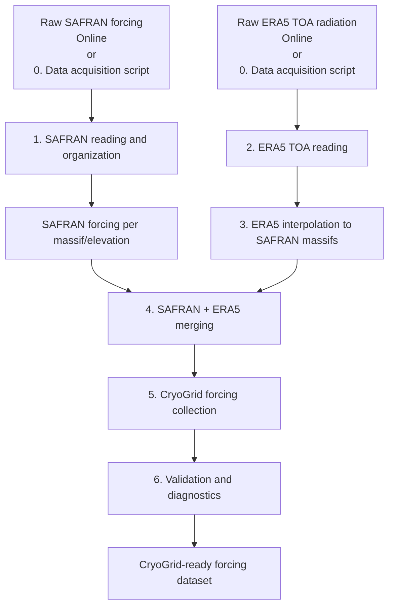

# VP_Forcing

## Overview

**VP_Forcing** is a MATLAB workflow to build CryoGrid-compatible meteorological forcing datasets from:

- SAFRAN/S2M meteorological forcing
- ERA5 top-of-atmosphere (TOA) solar radiation

The workflow processes, merges, validates, and documents forcing data for mountain permafrost simulations with CryoGrid.

The generated forcing contains:

- air temperature (`Tair`)
- incoming longwave radiation (`Lin`)
- incoming shortwave radiation (`Sin`)
- specific humidity (`q`)
- wind speed (`wind`)
- pressure (`p`)
- rainfall (`rainfall`)
- snowfall (`snowfall`)
- top-of-atmosphere solar radiation (`S_TOA`)

The complete processing chain is:



---

## Output forcing format

The final CryoGrid forcing collection is:

    CryoGrid_ready/FORCING_SAFRAN_ALL.mat


### Main structure

The MAT file contains all processed SAFRAN massifs and elevation levels,
combined with interpolated ERA5 top-of-atmosphere incoming solar radiation.

The main structure is:

    FORCING

        1 x Nmassif struct array

        Fields:

            name
            massif_num
            lon
            lat
            data
            polygon


Example:

    FORCING(1)

        name:       'Aravis'
        massif_num: 2
        lon:        6.3970
        lat:        45.8950

### Meteorological forcing data

The meteorological forcing data are stored in:

    FORCING(i).data


with the structure:

    data

        Tair
        Lin
        Sin
        q
        wind
        p
        rainfall
        snowfall
        t_span
        S_TOA
        z


Example:

    FORCING(1).data

        Tair:      [248369 x 10 single]
        Lin:       [248369 x 10 single]
        Sin:       [248369 x 10 single]
        q:         [248369 x 10 single]
        wind:      [248369 x 10 single]
        p:         [248369 x 10 single]
        rainfall:  [248369 x 10 single]
        snowfall:  [248369 x 10 single]
        t_span:    [248369 x 1 single]
        S_TOA:     [248369 x 1 single]
        z:         [1 x 10 single]


All meteorological variables are stored as:

    time x elevation


arrays.

For example:

    Tair [Nt x Nz]


where:

    Nt = number of forcing timesteps

    Nz = number of elevation levels


The elevation vector:

    z


contains the SAFRAN elevation levels used for each massif.

Example:

    z =

        300 600 900 1200 1500 1800 2100 2400 2700 3000


The temporal resolution of the forcing dataset is:

    3 hours


The forcing period corresponds to the complete processed SAFRAN period
with ERA5 TOA radiation added after interpolation to each SAFRAN massif.


### Massif metadata and polygons

Each massif also contains geographic information.

The polygon structure is:

    FORCING(i).polygon


with:

    polygon

        X
        Y
        Lon
        Lat


where:

    X, Y

are the original projected polygon coordinates
(Lambert-93 / EPSG:2154).


    Lon, Lat

are the corresponding geographic coordinates.

Example:

    FORCING(1).polygon

        X   : projected massif boundary coordinates
        Y   : projected massif boundary coordinates

        Lon : longitude coordinates
        Lat : latitude coordinates


These polygons allow the forcing dataset to retain the spatial definition
of each SAFRAN massif and can be used for geographic selection,
visualization, or future spatial processing.

---

## CryoGrid compatibility

The generated dataset is directly compatible with CryoGrid forcing readers.

Each massif contains:

- geographic metadata
- elevation levels
- meteorological forcing variables
- time vector
- radiation forcing


The forcing variables follow CryoGrid conventions:

| Variable | Description | Unit |
|----------|-------------|------|
| Tair | Air temperature | °C |
| Lin | Incoming longwave radiation | W m⁻² |
| Sin | Incoming shortwave radiation | W m⁻² |
| q | Specific humidity | kg kg⁻¹ |
| wind | Wind speed | m s⁻¹ |
| p | Surface pressure | Pa |
| rainfall | Rainfall rate | mm day⁻¹ |
| snowfall | Snowfall rate | mm day⁻¹ |
| S_TOA | Top-of-atmosphere solar radiation | W m⁻² |

---

# Workflow

> [!IMPORTANT]  
> The download of the ERA5 top of atmosphere incident solar radiation is handled in this repository but relies on Python rather than Matlab and hence needs to be done first, independently. See Section [Data acquisition](#data-acquisition) below.

The complete workflow is executed using:

[`prepare_forcing.m`](./prepare_forcing.m)

```matlab
prepare_forcing(forcing_path)
```

or 

```matlab
prepare_forcing(forcing_path,'Email','<user email address>')
```
if the user wishes to download the SAFRAN / S2M data at the beginning of the workflow, and

where `forcing_path` corresponds to the meteorological data root directory, and hence to:

[`CryoGridCommunity_forcing/meteo/`](../../../CryoGridCommunity_forcing/meteo/)

The workflow performs:

## Step 0 — SAFRAN / S2M downloading

Downloads all the input forcing files (SAFRAN / S2M data and shapefiles).

Main function:

[`download_S2M_data.m`](./acquisition/download_S2M_data.m)

Output:

[`CryoGridCommunity_forcing/meteo/SAFRAN/raw/`](../../../CryoGridCommunity_forcing/meteo/SAFRAN/raw/)
and
[`CryoGridCommunity_forcing/meteo/SAFRAN/shapefile/`](../../../CryoGridCommunity_forcing/meteo/SAFRAN/shapefile/)

## Step 1 — SAFRAN processing

Reads and organizes SAFRAN yearly NetCDF files.

Main function:

[`build_SAFRAN_per_massif.m`](./SAFRAN/build_SAFRAN_per_massif.m)

Output:

[`CryoGridCommunity_forcing/meteo/SAFRAN/per_massif/`](../../../CryoGridCommunity_forcing/meteo/SAFRAN/per_massif/)

---

## Step 2 — ERA5 TOA processing

Reads ERA5 TOA solar radiation files.

Main function:

[`build_ERA5_toa.m`](./ERA5/build_ERA5_toa.m)

Output:

[`CryoGridCommunity_forcing/meteo/ERA5/per_massif/`](../../../CryoGridCommunity_forcing/meteo/ERA5/per_massif/)

---

## Step 3 — ERA5 interpolation

Interpolates ERA5 radiation to SAFRAN massif locations.

Main function:

[`interpolate_ERA5_to_massifs.m`](./ERA5/interpolate_ERA5_to_massifs.m)

---

## Step 4 — SAFRAN and ERA5 merging

Combines meteorological forcing and TOA radiation.

Main function:

[`merge_SAFRAN_ERA5.m`](./merge/merge_SAFRAN_ERA5.m)

---

## Step 5 — CryoGrid forcing collection

Creates one combined forcing file.

Main function:

[`build_combined_forcing.m`](./merge/build_combined_forcing.m)

Output:

[`CryoGridCommunity_forcing/meteo/CryoGrid_ready/FORCING_SAFRAN_ALL.mat`](../../../CryoGridCommunity_forcing/meteo/CryoGrid_ready/FORCING_SAFRAN_ALL.mat)

---

## Step 6 — Validation

Runs forcing quality control and diagnostic plots.

Main function:

[`build_full_validation.m`](./validation/build_full_validation.m)

---

# Data acquisition

## SAFRAN / S2M

The workflow requires SAFRAN/S2M forcing data as input.

The acquisition procedure depends on the available data access method and dataset version. Two options are available to the user:

* Use the [`download_S2M_data.m`](./acquisition/download_S2M_data.m) included as Step 0 of the [Workflow](#workflow) section.
    1. Simply add an optional argument to [`download_S2M_data.m`](./acquisition/download_S2M_data.m) in the form of 
    ```matlab
    prepare_forcing(forcing_path,'Email','<user email address>')
    ```
    where the last field should be the user's personal email address.
    2. When the code stops and prompts you `Paste just the 'File name' from the email (e.g. 5ecf33e8-...-c34c.zip):`, open your email, copy the 'File name' field, and paste it into the MatlabCommand Window
    3. Press Enter.

* Direct download online from the AERIS landing page.
    1. https://www.aeris-data.fr/en/landing-page/?uuid=865730e8-edeb-4c6b-ae58-80f95166509b
    2. 'Download' tab
    3. Data selection:
        Versions  : 2024.1 (a new version is soon going to be released)
        Areas     : Alpes (flat)
        Products  : meteo
        Begin year: 1958 (soon 1940 in the new version)
        End year  : 2023 (soon 2025 in the new version)
    4. Tick 'I agree with the Data Policy' box
    5. Click 'DOWNLOAD'
    6. Enter your email address
    7. Press the link from the email received ('smtp' sender)
    8. Extract content of alp_flat/meteo into [`CryoGridCommunity_forcing/meteo/SAFRAN/raw/`](../../../CryoGridCommunity_forcing/meteo/SAFRAN/raw/)
    9. Go back to the AERIS page and click the orange 'Shapefiles' icon
    10. Extract content of s2m_shapefiles.zip/massifs_shapefiles.zip into [`CryoGridCommunity_forcing/meteo/SAFRAN/shapefile/`](../../../CryoGridCommunity_forcing/meteo/SAFRAN/shapefile/)

> [!NOTE]  
> A new version of the SAFRAN / S2M data will be available soon. It will rely on ERA5 reanalysis and hence will cover the full 1940-2025 period. When it is available on AERIS, make sure to modify the `payload.areas.alp_flat.meteo.files` and `payload.datasetVersion fields` in [`download_S2M_data.m`](./acquisition/download_S2M_data.m).

---

## ERA5 TOA radiation

ERA5 data are obtained from the Copernicus Climate Data Store. The workflow does not automatically download ERA5 data. The data can be downloaded throug the CDS API, but it relies on Python and hence this aprt cannot be included into the Worklow.

However, a Python script is provided to download the ERA5 top of atmosphere incident solar radiation

[`download_ERA5_TOA_data.py`](./acquisition/download_ERA5_TOA_data.py)

This needs to be done first, independently.

In order to properly setup the CDS API and run the Python script, the user needs to
1. Have a working version of Python and potentially install some packages
2. Follow the instructions at https://cds.climate.copernicus.eu/how-to-api
3. For Windows users, you will be redirected to https://confluence.ecmwf.int/spaces/CKB/pages/121847376/How+to+install+and+use+CDS+API+on+Windows
4. Once the environement is setup, run the Python script with
```python
python download_ERA5_TOA_data.py
```

This will automatically download all the ERA5 TOA annual data netCDF files into [`CryoGridCommunity_forcing/meteo/ERA5/raw/`](../../../CryoGridCommunity_forcing/meteo/ERA5/raw/)


The required CDS API request is provided here:
[`CryoGridCommunity_forcing/meteo/ERA5/raw/era5_toa_API_request_CDS.txt`](../../../CryoGridCommunity_forcing/meteo/ERA5/raw/era5_toa_API_request_CDS.txt)

This file documents the request used to download:

- ERA5 single-level reanalysis
- variable: `toa_incident_solar_radiation`
- NetCDF format
- Alpine domain

If the user wishes to download the yearly files individually directly from the Climate Data Store, this is also possible. They will need to be downloaded one by one, for each year, and then placed into
[`CryoGridCommunity_forcing/meteo/ERA5/raw/`](../../../CryoGridCommunity_forcing/meteo/ERA5/raw/)

---

# Folder structure

Recommended organization:

```
meteo/

├── SAFRAN/                                      [INPUT]
│   ├── raw/
│   │   └── FORCING.alp27_flat_*.nc              Raw SAFRAN S2M yearly forcing files
│   ├── shapefile/
│   │   └── massifs_alpes_2154.*                 SAFRAN massif polygons
│   └── per_massif/
│       └── safran_forcing_massif_*_elevation_*.mat
│                                                Intermediate SAFRAN forcing files
│
├── ERA5/                                        [INPUT + INTERMEDIATE]
│   ├── raw/
│   │   ├── era5_toa_*.nc                        Raw ERA5 TOA radiation files
│   │   └── era5_toa_API_request_CDS.txt         CDS API download request example
│   ├── merged/
│   │   └── ERA5_TOA_all.mat                     Concatenated ERA5 TOA dataset
│   └── per_massif/
│       └── TOA_per_massif.mat                   ERA5 TOA interpolated to SAFRAN massifs
│
├── CryoGrid_ready/                              [OUTPUT]
│   ├── FORCING_SAFRAN_ALL.mat                   Complete CryoGrid forcing collection
│   └── safran_forcing_massif_*_elevation_*.mat  Individual merged forcing files
│
└── forcing_diagnostics/                         [OUTPUT]
    ├── massif_*_*/                              Automated quality-control figures
    │   ├── vertical_state.png
    │   ├── radiation_profiles.png
    │   ├── gradients.png
    │   ├── time_series.png
    │   └── seasonal_cycle.png
    └── FORCING_validation_report.txt            Automated quality-control report
```

Intermediate products are kept to allow restarting the workflow without repeating expensive processing steps.

The final CryoGrid-ready dataset is stored in:

```
CryoGrid_ready/FORCING_SAFRAN_ALL.mat
```

while all validation results generated during the final workflow step are stored separately in:

```
forcing_diagnostics/
```

---

# Validation / diagnostics

Validation is performed automatically during step 6.

## Text validation

Function:

[`validate_CryoGrid_forcing.m`](./validation/validate_CryoGrid_forcing.m)

Checks:

- file structure
- variable dimensions
- data types
- missing values
- temporal consistency
- timestep regularity
- vertical atmospheric gradients
- physical consistency

Output:

[`CryoGridCommunity_forcing/meteo/forcing_diagnostics/FORCING_validation_report.txt`](../../../CryoGridCommunity_forcing/meteo/forcing_diagnostics/FORCING_validation_report.txt)

---

## Diagnostic plots

Function:

[`plot_forcing_diagnostics.m`](./validation/plot_forcing_diagnostics.m)

Creates diagnostic figures for each massif:

[`CryoGridCommunity_forcing/meteo/forcing_diagnostics/`](../../../CryoGridCommunity_forcing/meteo/forcing_diagnostics/)

Including:

- vertical atmospheric state
- radiation profiles
- vertical gradients
- time series
- seasonal cycles

---

# Running the workflow

Example:

```matlab
forcing_path = "path/to/meteo";

prepare_forcing(forcing_path)
```

The final output is:

```
CryoGrid_ready/
    FORCING_SAFRAN_ALL.mat
```

which can directly be used by CryoGrid workflows.

---

# Main scripts and functions

## Workflow

- [`prepare_forcing.m`](./prepare_forcing.m)

## Acquisition

- [`download_S2M_data.m`](./acquisition/download_S2M_data.m)
- [`download_ERA5_TOA_data.py`](./acquisition/download_ERA5_TOA_data.py)

## SAFRAN

- [`build_SAFRAN_per_massif.m`](./SAFRAN/build_SAFRAN_per_massif.m)

## ERA5

- [`build_ERA5_toa.m`](./ERA5/build_ERA5_toa.m)
- [`interpolate_ERA5_to_massifs.m`](./ERA5/interpolate_ERA5_to_massifs.m)

## Merging

- [`merge_SAFRAN_ERA5.m`](./merge/merge_SAFRAN_ERA5.m)
- [`build_combined_forcing.m`](./merge/build_combined_forcing.m)

## Validation / diagnostics

- [`build_full_validation.m`](./validation/build_full_validation.m)
- [`validate_CryoGrid_forcing.m`](./validation/validate_CryoGrid_forcing.m)
- [`plot_forcing_diagnostics.m`](./validation/plot_forcing_diagnostics.m)

---

# Future improvements

Possible future developments:

- automated SAFRAN acquisition
- automated ERA5 CDS download
