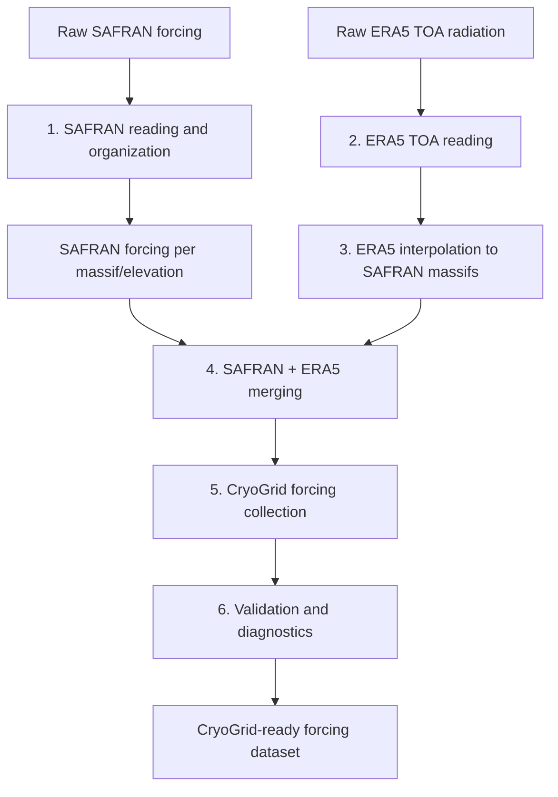

# VP_Forcing

## Overview

**VP_Forcing** is a MATLAB workflow to build CryoGrid-compatible meteorological forcing datasets from:

- SAFRAN/S2M meteorological forcing
- ERA5 top-of-atmosphere (TOA) solar radiation

The workflow processes, merges, validates, and documents forcing data for mountain permafrost simulations with CryoGrid.

The generated forcing contains:

- air temperature (`Tair`)
- incoming longwave radiation (`Lin`)
- incoming shortwave radiation (`Sin`)
- specific humidity (`q`)
- wind speed (`wind`)
- pressure (`p`)
- rainfall (`rainfall`)
- snowfall (`snowfall`)
- top-of-atmosphere solar radiation (`S_TOA`)

The complete processing chain is:



---

## Output forcing format

The final CryoGrid forcing collection is:

    CryoGrid_ready/FORCING_SAFRAN_ALL.mat


### Main structure

The MAT file contains all processed SAFRAN massifs and elevation levels,
combined with interpolated ERA5 top-of-atmosphere incoming solar radiation.

The main structure is:

    FORCING

        1 x Nmassif struct array

        Fields:

            name
            massif_num
            lon
            lat
            data
            polygon


Example:

    FORCING(1)

        name:       'Aravis'
        massif_num: 2
        lon:        6.3970
        lat:        45.8950

### Meteorological forcing data

The meteorological forcing data are stored in:

    FORCING(i).data


with the structure:

    data

        Tair
        Lin
        Sin
        q
        wind
        p
        rainfall
        snowfall
        t_span
        S_TOA
        z


Example:

    FORCING(1).data

        Tair:      [248369 x 10 single]
        Lin:       [248369 x 10 single]
        Sin:       [248369 x 10 single]
        q:         [248369 x 10 single]
        wind:      [248369 x 10 single]
        p:         [248369 x 10 single]
        rainfall:  [248369 x 10 single]
        snowfall:  [248369 x 10 single]
        t_span:    [248369 x 1 single]
        S_TOA:     [248369 x 1 single]
        z:         [1 x 10 single]


All meteorological variables are stored as:

    time x elevation


arrays.

For example:

    Tair [Nt x Nz]


where:

    Nt = number of forcing timesteps

    Nz = number of elevation levels


The elevation vector:

    z


contains the SAFRAN elevation levels used for each massif.

Example:

    z =

        300 600 900 1200 1500 1800 2100 2400 2700 3000


The temporal resolution of the forcing dataset is:

    3 hours


The forcing period corresponds to the complete processed SAFRAN period
with ERA5 TOA radiation added after interpolation to each SAFRAN massif.


### Massif metadata and polygons

Each massif also contains geographic information.

The polygon structure is:

    FORCING(i).polygon


with:

    polygon

        X
        Y
        Lon
        Lat


where:

    X, Y

are the original projected polygon coordinates
(Lambert-93 / EPSG:2154).


    Lon, Lat

are the corresponding geographic coordinates.

Example:

    FORCING(1).polygon

        X   : projected massif boundary coordinates
        Y   : projected massif boundary coordinates

        Lon : longitude coordinates
        Lat : latitude coordinates


These polygons allow the forcing dataset to retain the spatial definition
of each SAFRAN massif and can be used for geographic selection,
visualization, or future spatial processing.

---

## CryoGrid compatibility

The generated dataset is directly compatible with CryoGrid forcing readers.

Each massif contains:

- geographic metadata
- elevation levels
- meteorological forcing variables
- time vector
- radiation forcing


The forcing variables follow CryoGrid conventions:

| Variable | Description | Unit |
|----------|-------------|------|
| Tair | Air temperature | °C |
| Lin | Incoming longwave radiation | W m⁻² |
| Sin | Incoming shortwave radiation | W m⁻² |
| q | Specific humidity | kg kg⁻¹ |
| wind | Wind speed | m s⁻¹ |
| p | Surface pressure | Pa |
| rainfall | Rainfall rate | mm day⁻¹ |
| snowfall | Snowfall rate | mm day⁻¹ |
| S_TOA | Top-of-atmosphere solar radiation | W m⁻² |

---

# Workflow

The complete workflow is executed using:

[`prepare_forcing.m`](./prepare_forcing.m)

```matlab
prepare_forcing(forcing_path)
```

where `forcing_path` corresponds to the meteorological data root directory.

The workflow performs:

## Step 1 — SAFRAN processing

Reads and organizes SAFRAN yearly NetCDF files.

Main function:

[`build_SAFRAN_per_massif.m`](./SAFRAN/build_SAFRAN_per_massif.m)

Output:

[`CryoGridCommunity_forcing/meteo/SAFRAN/per_massif/`](../../../CryoGridCommunity_forcing/meteo/SAFRAN/per_massif/)

---

## Step 2 — ERA5 TOA processing

Reads ERA5 TOA solar radiation files.

Main function:

[`build_ERA5_toa.m`](./ERA5/build_ERA5_toa.m)

Output:

[`CryoGridCommunity_forcing/meteo/ERA5/per_massif/`](../../../CryoGridCommunity_forcing/meteo/ERA5/per_massif/)

---

## Step 3 — ERA5 interpolation

Interpolates ERA5 radiation to SAFRAN massif locations.

Main function:

[`interpolate_ERA5_to_massifs.m`](./ERA5/interpolate_ERA5_to_massifs.m)

---

## Step 4 — SAFRAN and ERA5 merging

Combines meteorological forcing and TOA radiation.

Main function:

[`merge_SAFRAN_ERA5.m`](./merge/merge_SAFRAN_ERA5.m)

---

## Step 5 — CryoGrid forcing collection

Creates one combined forcing file.

Main function:

[`build_combined_forcing.m`](./merge/build_combined_forcing.m)

Output:

[`CryoGridCommunity_forcing/meteo/CryoGrid_ready/FORCING_SAFRAN_ALL.mat`](../../../CryoGridCommunity_forcing/meteo/CryoGrid_ready/FORCING_SAFRAN_ALL.mat)

---

## Step 6 — Validation

Runs forcing quality control and diagnostic plots.

Main function:

[`build_full_validation.m`](./validation/build_full_validation.m)

---

# Data acquisition

## SAFRAN / S2M

The workflow requires SAFRAN/S2M forcing data as input.

The acquisition procedure depends on the available data access method and dataset version.

TODO:

Add detailed SAFRAN/S2M download instructions and citation.

---

## ERA5 TOA radiation

ERA5 data are obtained from the Copernicus Climate Data Store.

The workflow does not automatically download ERA5 data.

The required CDS API request is provided here:

[`CryoGridCommunity_forcing/meteo/ERA5/raw/era5_toa_API_request_CDS.txt`](../../../CryoGridCommunity_forcing/meteo/ERA5/raw/era5_toa_API_request_CDS.txt)

This file documents the request used to download:

- ERA5 single-level reanalysis
- variable: `toa_incident_solar_radiation`
- NetCDF format
- Alpine domain

Example usage:

```python
import cdsapi

client = cdsapi.Client()
client.retrieve(dataset, request).download()
```

The downloaded files should be placed in:

[`CryoGridCommunity_forcing/meteo/ERA5/raw/`](../../../CryoGridCommunity_forcing/meteo/ERA5/raw/)

---

# Folder structure

Recommended organization:

```
meteo/

├── SAFRAN/                                      [INPUT]
│   ├── raw/
│   │   └── FORCING.alp27_flat_*.nc              Raw SAFRAN S2M yearly forcing files
│   ├── shapefile/
│   │   └── massifs_alpes_2154.*                 SAFRAN massif polygons
│   └── per_massif/
│       └── safran_forcing_massif_*_elevation_*.mat
│                                                Intermediate SAFRAN forcing files
│
├── ERA5/                                        [INPUT + INTERMEDIATE]
│   ├── raw/
│   │   ├── era5_toa_*.nc                        Raw ERA5 TOA radiation files
│   │   └── era5_toa_API_request_CDS.txt         CDS API download request example
│   ├── merged/
│   │   └── ERA5_TOA_all.mat                     Concatenated ERA5 TOA dataset
│   └── per_massif/
│       └── TOA_per_massif.mat                   ERA5 TOA interpolated to SAFRAN massifs
│
├── CryoGrid_ready/                              [OUTPUT]
│   ├── FORCING_SAFRAN_ALL.mat                   Complete CryoGrid forcing collection
│   └── safran_forcing_massif_*_elevation_*.mat  Individual merged forcing files
│
└── forcing_diagnostics/                         [OUTPUT]
    ├── massif_*_*/                              Automated quality-control figures
    │   ├── vertical_state.png
    │   ├── radiation_profiles.png
    │   ├── gradients.png
    │   ├── time_series.png
    │   └── seasonal_cycle.png
    └── FORCING_validation_report.txt            Automated quality-control report
```

Intermediate products are kept to allow restarting the workflow without repeating expensive processing steps.

The final CryoGrid-ready dataset is stored in:

```
CryoGrid_ready/FORCING_SAFRAN_ALL.mat
```

while all validation results generated during the final workflow step are stored separately in:

```
forcing_diagnostics/
```

---

# Validation / diagnostics

Validation is performed automatically during step 6.

## Text validation

Function:

[`validate_CryoGrid_forcing.m`](./validation/validate_CryoGrid_forcing.m)

Checks:

- file structure
- variable dimensions
- data types
- missing values
- temporal consistency
- timestep regularity
- vertical atmospheric gradients
- physical consistency

Output:

[`CryoGridCommunity_forcing/meteo/forcing_diagnostics/FORCING_validation_report.txt`](../../../CryoGridCommunity_forcing/meteo/forcing_diagnostics/FORCING_validation_report.txt)

---

## Diagnostic plots

Function:

[`plot_forcing_diagnostics.m`](./validation/plot_forcing_diagnostics.m)

Creates diagnostic figures for each massif:

[`CryoGridCommunity_forcing/meteo/forcing_diagnostics/`](../../../CryoGridCommunity_forcing/meteo/forcing_diagnostics/)

Including:

- vertical atmospheric state
- radiation profiles
- vertical gradients
- time series
- seasonal cycles

---

# Running the workflow

Example:

```matlab
forcing_path = "path/to/meteo";

prepare_forcing(forcing_path)
```

The final output is:

```
CryoGrid_ready/
    FORCING_SAFRAN_ALL.mat
```

which can directly be used by CryoGrid workflows.

---

# Main scripts and functions

## Workflow

- [`prepare_forcing.m`](./prepare_forcing.m)

## SAFRAN

- [`build_SAFRAN_per_massif.m`](./build_SAFRAN_per_massif.m)

## ERA5

- [`build_ERA5_toa.m`](./build_ERA5_toa.m)
- [`interpolate_ERA5_to_massifs.m`](./interpolate_ERA5_to_massifs.m)

## Merging

- [`merge_SAFRAN_ERA5.m`](./merge_SAFRAN_ERA5.m)
- [`build_combined_forcing.m`](./build_combined_forcing.m)

## Validation

- [`build_full_validation.m`](./build_full_validation.m)
- [`validate_CryoGrid_forcing.m`](./validate_CryoGrid_forcing.m)
- [`plot_forcing_diagnostics.m`](./plot_forcing_diagnostics.m)

---

# Future improvements

Possible future developments:

- automated SAFRAN acquisition
- automated ERA5 CDS download
