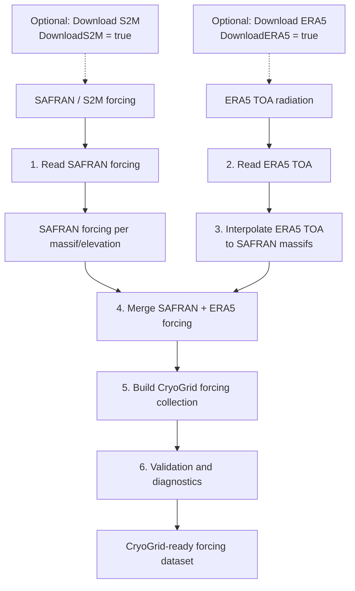

# VP_Meteo

## Overview

**VP_Meteo** is a MATLAB workflow to build CryoGrid-compatible meteorological forcing datasets from:

- SAFRAN/S2M meteorological forcing
- ERA5 top-of-atmosphere (TOA) solar radiation

The workflow processes, merges, validates, and documents forcing data for mountain permafrost simulations with CryoGrid.

The generated forcing contains:

- air temperature (`Tair`)
- incoming longwave radiation (`Lin`)
- incoming shortwave radiation (`Sin`)
- specific humidity (`q`)
- wind speed (`wind`)
- pressure (`p`)
- rainfall (`rainfall`)
- snowfall (`snowfall`)
- top-of-atmosphere solar radiation (`S_TOA`)

The complete processing chain is:



---

## Output forcing format

The final CryoGrid forcing collection is:

    CryoGrid_ready/FORCING_SAFRAN_ALL.mat


### Main structure

The MAT file contains all processed SAFRAN massifs and elevation levels,
combined with interpolated ERA5 top-of-atmosphere incoming solar radiation.

The main structure is:

    FORCING

        1 x Nmassif struct array

        Fields:

            name
            massif_num
            lon
            lat
            data
            polygon


Example:

    FORCING(1)

        name:       'Aravis'
        massif_num: 2
        lon:        6.3970
        lat:        45.8950

### Meteorological forcing data

The meteorological forcing data are stored in:

    FORCING(i).data


with the structure:

    data

        Tair
        Lin
        Sin
        q
        wind
        p
        rainfall
        snowfall
        t_span
        S_TOA
        z


Example:

    FORCING(1).data

        Tair:      [248369 x 10 single]
        Lin:       [248369 x 10 single]
        Sin:       [248369 x 10 single]
        q:         [248369 x 10 single]
        wind:      [248369 x 10 single]
        p:         [248369 x 10 single]
        rainfall:  [248369 x 10 single]
        snowfall:  [248369 x 10 single]
        t_span:    [248369 x 1 single]
        S_TOA:     [248369 x 1 single]
        z:         [1 x 10 single]


All meteorological variables are stored as:

    time x elevation


arrays.

For example:

    Tair [Nt x Nz]


where:

    Nt = number of forcing timesteps

    Nz = number of elevation levels


The elevation vector:

    z


contains the SAFRAN elevation levels used for each massif.

Example:

    z =

        300 600 900 1200 1500 1800 2100 2400 2700 3000


The temporal resolution of the forcing dataset is:

    3 hours


The forcing period corresponds to the complete processed SAFRAN period
with ERA5 TOA radiation added after interpolation to each SAFRAN massif.


### Massif metadata and polygons

Each massif also contains geographic information.

The polygon structure is:

    FORCING(i).polygon


with:

    polygon

        X
        Y
        Lon
        Lat


where:

    X, Y

are the original projected polygon coordinates
(Lambert-93 / EPSG:2154).


    Lon, Lat

are the corresponding geographic coordinates.

Example:

    FORCING(1).polygon

        X   : projected massif boundary coordinates
        Y   : projected massif boundary coordinates

        Lon : longitude coordinates
        Lat : latitude coordinates


These polygons allow the forcing dataset to retain the spatial definition
of each SAFRAN massif and can be used for geographic selection,
visualization, or future spatial processing.

---

## CryoGrid compatibility

The generated dataset is directly compatible with CryoGrid forcing readers.

Each massif contains:

- geographic metadata
- elevation levels
- meteorological forcing variables
- time vector
- radiation forcing


The forcing variables follow CryoGrid conventions:

| Variable | Description | Unit |
|----------|-------------|------|
| Tair | Air temperature | °C |
| Lin | Incoming longwave radiation | W m⁻² |
| Sin | Incoming shortwave radiation | W m⁻² |
| q | Specific humidity | kg kg⁻¹ |
| wind | Wind speed | m s⁻¹ |
| p | Surface pressure | Pa |
| rainfall | Rainfall rate | mm day⁻¹ |
| snowfall | Snowfall rate | mm day⁻¹ |
| S_TOA | Top-of-atmosphere solar radiation | W m⁻² |

---

# Workflow

The complete VP_Meteo workflow is executed using:

[`prepare_forcing.m`](./prepare_forcing.m)

```matlab
prepare_forcing(meteo_path)
```

where `meteo_path` is the root directory containing the meteorological forcing datasets:

[`CryoGridCommunity_forcing/meteo/`](../../../CryoGridCommunity_forcing/meteo/)

By default, the workflow assumes that the required SAFRAN/S2M and ERA5 input datasets already exist.

Optional acquisition can be enabled independently for the two datasets:

```matlab
prepare_forcing( ...
    meteo_path, ...
    'DownloadS2M',true, ...
    'Email','<user email address>', ...
    'DownloadERA5',true, ...
    'PythonExecutable','C:\path\to\python.exe')
```

The complete processing chain is:

1. Optionally acquire SAFRAN/S2M forcing.
2. Optionally acquire ERA5 top-of-atmosphere radiation.
3. Read and organize SAFRAN forcing by massif.
4. Read and concatenate ERA5 TOA radiation.
5. Interpolate ERA5 TOA radiation to SAFRAN massif locations.
6. Merge SAFRAN and ERA5 forcing.
7. Build the combined CryoGrid forcing collection.
8. Validate the resulting forcing dataset.

The `VP_Meteo` module can be run independently. Within the complete CryoGrid VP workflow, [`prepare_VP.m`](../../../CryoGridCommunity_run/prepare_VP.m) can call `prepare_forcing` automatically.

## Configuration

`prepare_forcing` is designed to be self-contained. All information required by the workflow is supplied through its function arguments.

The main input is:

```matlab
prepare_forcing(meteo_path)
```

where `meteo_path` defines the root of the meteorological forcing directory.

Optional data acquisition is controlled using the following parameters:

| Option | Default | Purpose |
|--------|---------|---------|
| `DownloadS2M` | `false` | Automatically acquire SAFRAN/S2M forcing |
| `Email` | `'none'` | Email address used for S2M acquisition |
| `DownloadERA5` | `false` | Automatically acquire ERA5 TOA radiation |
| `PythonExecutable` | `''` | Python executable used for ERA5 acquisition |

The two acquisition workflows are independent.

If `DownloadS2M` is `false`, existing SAFRAN/S2M files are assumed to be available.

If `DownloadERA5` is `false`, existing ERA5 NetCDF files are assumed to be available.

The `PythonExecutable` option is only required when `DownloadERA5` is enabled.

For example:

```matlab
prepare_forcing( ...
    meteo_path, ...
    'DownloadS2M',true, ...
    'Email','<user email address>')
```

or:

```matlab
prepare_forcing( ...
    meteo_path, ...
    'DownloadERA5',true, ...
    'PythonExecutable','C:\path\to\python.exe')
```

Both acquisition steps can be enabled simultaneously:

```matlab
prepare_forcing( ...
    meteo_path, ...
    'DownloadS2M',true, ...
    'Email','<user email address>', ...
    'DownloadERA5',true, ...
    'PythonExecutable','C:\path\to\python.exe')
```

When `prepare_forcing` is called from the complete VP workflow, these arguments can be supplied automatically by the higher-level workflow.


## Step 0 — SAFRAN / S2M downloading

Downloads the input SAFRAN/S2M meteorological forcing files and associated shapefiles.

Main function:

[`download_S2M_data.m`](./acquisition/download_S2M_data.m)

This step is controlled by the `DownloadS2M` option.

By default:

```matlab
prepare_forcing(meteo_path)
```

does not download S2M data and assumes that the required files already exist.

To enable automatic acquisition:

```matlab
prepare_forcing( ...
    meteo_path, ...
    'DownloadS2M',true, ...
    'Email','<user email address>')
```

The `Email` option is only used when `DownloadS2M` is enabled.

Output:

[`CryoGridCommunity_forcing/meteo/SAFRAN/raw/`](../../../CryoGridCommunity_forcing/meteo/SAFRAN/raw/)

and:

[`CryoGridCommunity_forcing/meteo/SAFRAN/shapefile/`](../../../CryoGridCommunity_forcing/meteo/SAFRAN/shapefile/)

If the data have already been downloaded manually, simply leave `DownloadS2M` at its default value:

```matlab
prepare_forcing(meteo_path)
```

## Step 0.5 — ERA5 TOA radiation downloading

Downloads ERA5 top-of-atmosphere (TOA) incident solar radiation using the Copernicus Climate Data Store (CDS) API.

Main MATLAB wrapper:

[`download_ERA5_TOA.m`](./acquisition/download_ERA5_TOA.m)

The wrapper receives the Python executable explicitly:

```matlab
download_ERA5_TOA(python_executable)
```

It:

- configures MATLAB to use the supplied Python executable,
- locates the Python acquisition script,
- automatically determines the CryoGrid repository root,
- passes the repository root to Python,
- checks existing yearly files,
- downloads only missing or invalid years.

The Python acquisition script is:

[`download_ERA5_TOA_data.py`](./acquisition/download_ERA5_TOA_data.py)

The Python script provides:

- yearly downloads,
- automatic restart capability,
- NetCDF validation,
- automatic file naming:

```text
era5_toa_YYYY.nc
```

This step is controlled by the `DownloadERA5` option.

To enable automatic acquisition:

```matlab
prepare_forcing( ...
    meteo_path, ...
    'DownloadERA5',true, ...
    'PythonExecutable','C:\path\to\python.exe')
```

If `DownloadERA5` is `false` (default), the workflow assumes that the required ERA5 NetCDF files already exist.

Output:

[`CryoGridCommunity_forcing/meteo/ERA5/raw/`](../../../CryoGridCommunity_forcing/meteo/ERA5/raw/)

## Step 1 — SAFRAN processing

Reads and organizes SAFRAN yearly NetCDF files.

Main function:

[`build_SAFRAN_per_massif.m`](./SAFRAN/build_SAFRAN_per_massif.m)

Output:

[`CryoGridCommunity_forcing/meteo/SAFRAN/per_massif/`](../../../CryoGridCommunity_forcing/meteo/SAFRAN/per_massif/)

---

## Step 2 — ERA5 TOA processing

Reads ERA5 TOA solar radiation files.

Main function:

[`build_ERA5_toa.m`](./ERA5/build_ERA5_toa.m)

Output:

[`CryoGridCommunity_forcing/meteo/ERA5/per_massif/`](../../../CryoGridCommunity_forcing/meteo/ERA5/per_massif/)

---

## Step 3 — ERA5 interpolation

Interpolates ERA5 radiation to SAFRAN massif locations.

Main function:

[`interpolate_ERA5_to_massifs.m`](./ERA5/interpolate_ERA5_to_massifs.m)

---

## Step 4 — SAFRAN and ERA5 merging

Combines meteorological forcing and TOA radiation.

Main function:

[`merge_SAFRAN_ERA5.m`](./merge/merge_SAFRAN_ERA5.m)

---

## Step 5 — CryoGrid forcing collection

Creates one combined forcing file.

Main function:

[`build_combined_forcing.m`](./merge/build_combined_forcing.m)

Output:

[`CryoGridCommunity_forcing/meteo/CryoGrid_ready/FORCING_SAFRAN_ALL.mat`](../../../CryoGridCommunity_forcing/meteo/CryoGrid_ready/FORCING_SAFRAN_ALL.mat)

---

## Step 6 — Validation

Runs forcing quality control and diagnostic plots.

Main function:

[`build_full_validation.m`](./validation/build_full_validation.m)

---

# Data acquisition

## SAFRAN / S2M

The workflow requires SAFRAN/S2M forcing data as input.

The acquisition procedure depends on the available data access method and dataset version. Two options are available to the user:

* Use the [`download_S2M_data.m`](./acquisition/download_S2M_data.m) included as Step 0 of the [Workflow](#workflow) section.
    1. Simply add an optional argument to [`download_S2M_data.m`](./acquisition/download_S2M_data.m) in the form of 
    ```matlab
    prepare_forcing(meteo_path,'Email','<user email address>')
    ```
    where the last field should be the user's personal email address.
    2. When the code stops and prompts you `Paste just the 'File name' from the email (e.g. 5ecf33e8-...-c34c.zip):`, open your email, copy the 'File name' field, and paste it into the MatlabCommand Window
    3. Press Enter.

* Direct download online from the AERIS landing page.
    1. https://www.aeris-data.fr/en/landing-page/?uuid=865730e8-edeb-4c6b-ae58-80f95166509b
    2. 'Download' tab
    3. Data selection:
        Versions  : 2024.1 (a new version is soon going to be released)
        Areas     : Alpes (flat)
        Products  : meteo
        Begin year: 1958 (soon 1940 in the new version)
        End year  : 2023 (soon 2025 in the new version)
    4. Tick 'I agree with the Data Policy' box
    5. Click 'DOWNLOAD'
    6. Enter your email address
    7. Press the link from the email received ('smtp' sender)
    8. Extract content of alp_flat/meteo into [`CryoGridCommunity_forcing/meteo/SAFRAN/raw/`](../../../CryoGridCommunity_forcing/meteo/SAFRAN/raw/)
    9. Go back to the AERIS page and click the orange 'Shapefiles' icon
    10. Extract content of s2m_shapefiles.zip/massifs_shapefiles.zip into [`CryoGridCommunity_forcing/meteo/SAFRAN/shapefile/`](../../../CryoGridCommunity_forcing/meteo/SAFRAN/shapefile/)

> [!NOTE]  
> A new version of the SAFRAN / S2M data will be available soon. It will rely on ERA5 reanalysis and hence will cover the full 1940-2025 period. When it is available on AERIS, make sure to modify the `payload.areas.alp_flat.meteo.files` and `payload.datasetVersion fields` in [`download_S2M_data.m`](./acquisition/download_S2M_data.m).

---

## ERA5 TOA radiation acquisition

ERA5 top-of-atmosphere incident solar radiation is obtained from the
Copernicus Climate Data Store (CDS).

The acquisition is integrated into the MATLAB workflow through:

[`download_ERA5_TOA.m`](./acquisition/download_ERA5_TOA.m)

which calls:

[`download_ERA5_TOA_data.py`](./acquisition/download_ERA5_TOA_data.py)

### Python environment setup

Automatic ERA5 acquisition requires a working Python environment with:

```text
cdsapi
netCDF4
```

Install the required packages with:

```bash
pip install cdsapi netCDF4
```

The CDS API must also be configured with a valid API configuration.

Instructions are available from the [Copernicus Climate Data Store API documentation](https://cds.climate.copernicus.eu/how-to-api).

For Windows users, additional instructions are available from the [ECMWF CDS API Windows documentation](https://confluence.ecmwf.int/spaces/CKB/pages/121847376/How+to+install+and+use+CDS+API+on+Windows).

The Python executable is supplied directly to
`download_ERA5_TOA` through the `PythonExecutable` option of
`prepare_forcing`.

For example:

```matlab
prepare_forcing( ...
    meteo_path, ...
    'DownloadERA5',true, ...
    'PythonExecutable','C:\path\to\python.exe')
```

### ERA5 download details

The script downloads:

- ERA5 single-level reanalysis
- `toa_incident_solar_radiation`
- NetCDF format
- the configured Alpine domain
- yearly files

The output files are:

```text
era5_toa_YYYY.nc
```

stored in:

[`CryoGridCommunity_forcing/meteo/ERA5/raw/`](../../../CryoGridCommunity_forcing/meteo/ERA5/raw/)

The download is restartable:

- existing valid yearly files are skipped,
- incomplete or corrupted files are removed and re-downloaded.

The corresponding CDS API request is documented in:

[`era5_toa_API_request_CDS.txt`](../../../CryoGridCommunity_forcing/meteo/ERA5/raw/era5_toa_API_request_CDS.txt)

---

# Folder structure

Recommended organization:

```
meteo/

├── SAFRAN/                                      [INPUT]
│   ├── raw/
│   │   └── FORCING.alp27_flat_*.nc              Raw SAFRAN S2M yearly forcing files
│   ├── shapefile/
│   │   └── massifs_alpes_2154.*                 SAFRAN massif polygons
│   └── per_massif/
│       └── safran_forcing_massif_*_elevation_*.mat
│                                                Intermediate SAFRAN forcing files
│
├── ERA5/                                        [INPUT + INTERMEDIATE]
│   ├── raw/
│   │   ├── era5_toa_*.nc                        Raw ERA5 TOA radiation files
│   │   └── era5_toa_API_request_CDS.txt         CDS API download request example
│   ├── merged/
│   │   └── ERA5_TOA_all.mat                     Concatenated ERA5 TOA dataset
│   └── per_massif/
│       └── TOA_per_massif.mat                   ERA5 TOA interpolated to SAFRAN massifs
│
├── CryoGrid_ready/                              [OUTPUT]
│   ├── FORCING_SAFRAN_ALL.mat                   Complete CryoGrid forcing collection
│   └── safran_forcing_massif_*_elevation_*.mat  Individual merged forcing files
│
└── forcing_diagnostics/                         [OUTPUT]
    ├── massif_*_*/                              Automated quality-control figures
    │   ├── vertical_state.png
    │   ├── radiation_profiles.png
    │   ├── gradients.png
    │   ├── time_series.png
    │   └── seasonal_cycle.png
    └── FORCING_validation_report.txt            Automated quality-control report
```

Intermediate products are kept to allow restarting the workflow without repeating expensive processing steps.

The final CryoGrid-ready dataset is stored in:

```
CryoGrid_ready/FORCING_SAFRAN_ALL.mat
```

while all validation results generated during the final workflow step are stored separately in:

```
forcing_diagnostics/
```

---

# Validation / diagnostics

Validation is performed automatically during step 6.

## Text validation

Function:

[`validate_CryoGrid_forcing.m`](./validation/validate_CryoGrid_forcing.m)

Checks:

- file structure
- variable dimensions
- data types
- missing values
- temporal consistency
- timestep regularity
- vertical atmospheric gradients
- physical consistency

Output:

[`CryoGridCommunity_forcing/meteo/forcing_diagnostics/FORCING_validation_report.txt`](../../../CryoGridCommunity_forcing/meteo/forcing_diagnostics/FORCING_validation_report.txt)

---

## Diagnostic plots

Function:

[`plot_forcing_diagnostics.m`](./validation/plot_forcing_diagnostics.m)

Creates diagnostic figures for each massif:

[`CryoGridCommunity_forcing/meteo/forcing_diagnostics/`](../../../CryoGridCommunity_forcing/meteo/forcing_diagnostics/)

Including:

- vertical atmospheric state
- radiation profiles
- vertical gradients
- time series
- seasonal cycles

---

# Running the workflow

The simplest way to run the complete meteorological preprocessing workflow is:

```matlab
prepare_forcing(meteo_path)
```

This assumes that all required raw datasets have already been downloaded.

To automatically acquire SAFRAN/S2M:

```matlab
prepare_forcing( ...
    meteo_path, ...
    'DownloadS2M',true, ...
    'Email','<user email address>')
```

To automatically acquire ERA5 TOA radiation:

```matlab
prepare_forcing( ...
    meteo_path, ...
    'DownloadERA5',true, ...
    'PythonExecutable','C:\path\to\python.exe')
```

To acquire both datasets:

```matlab
prepare_forcing( ...
    meteo_path, ...
    'DownloadS2M',true, ...
    'Email','<user email address>', ...
    'DownloadERA5',true, ...
    'PythonExecutable','C:\path\to\python.exe')
```

The final output is:

```text
CryoGrid_ready/
    FORCING_SAFRAN_ALL.mat
```

which can directly be used by CryoGrid workflows.

When using the complete CryoGrid VP workflow, the higher-level [`prepare_VP.m`](../../../CryoGridCommunity_run/prepare_VP.m) function can call `prepare_forcing` together with the other VP preparation modules.

---

# Main scripts and functions

## Main workflow

- [`prepare_forcing.m`](./prepare_forcing.m)

## Acquisition

- [`download_S2M_data.m`](./acquisition/download_S2M_data.m)
- [`download_ERA5_TOA.m`](./acquisition/download_ERA5_TOA.m)
- [`download_ERA5_TOA_data.py`](./acquisition/download_ERA5_TOA_data.py)

## SAFRAN

- [`build_SAFRAN_per_massif.m`](./SAFRAN/build_SAFRAN_per_massif.m)

## ERA5

- [`build_ERA5_toa.m`](./ERA5/build_ERA5_toa.m)
- [`interpolate_ERA5_to_massifs.m`](./ERA5/interpolate_ERA5_to_massifs.m)

## Merging

- [`merge_SAFRAN_ERA5.m`](./merge/merge_SAFRAN_ERA5.m)
- [`build_combined_forcing.m`](./merge/build_combined_forcing.m)

## Validation / diagnostics

- [`build_full_validation.m`](./validation/build_full_validation.m)
- [`validate_CryoGrid_forcing.m`](./validation/validate_CryoGrid_forcing.m)
- [`plot_forcing_diagnostics.m`](./validation/plot_forcing_diagnostics.m)

## Complete VP workflow

When `VP_Meteo` is used as part of the complete CryoGrid VP workflow, [`prepare_VP.m`](../../../CryoGridCommunity_run/prepare_VP.m) provides the higher-level entry point and supplies the required paths and configuration automatically.

---

# Future improvements

Possible future developments:

- automated SAFRAN acquisition
- automated ERA5 CDS download
